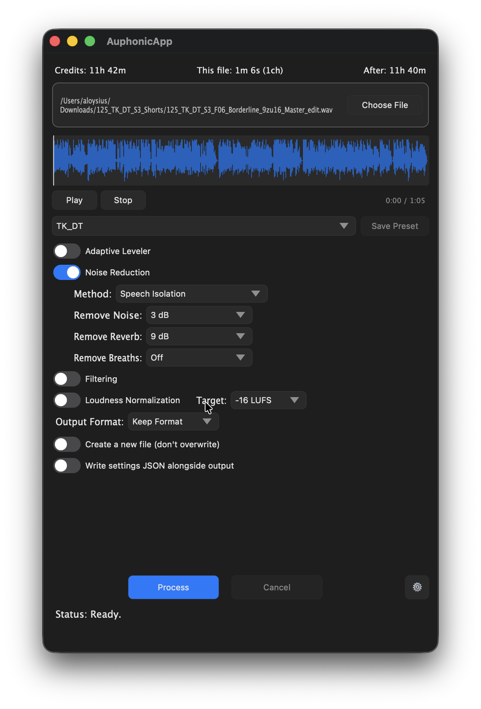

<p align="center">
  
</p>

<h1 align="center">AuphonicApp</h1>

A lightweight macOS desktop client for [Auphonic](https://auphonic.com) audio post-production. Drag in an audio file, pick your settings, and let Auphonic handle the rest.

## Features

- **Drag-and-drop** audio files for processing
- **Presets** — load existing Auphonic presets or save new ones
- **Manual processing controls** — adaptive leveler, noise reduction, loudness normalization, filtering, music/speech separation, and broadcast mode
- **Channel selection** — process individual channels from multi-channel files
- **Output format & bitrate** — choose your format or keep the original
- **Batch Processing**
- **Credit tracking** — see available credits and estimated cost before processing
- **Progress feedback** — real-time status during upload, processing, and download
- **Show in Finder** — reveal the output file when done

<p align="center">
  
</p>

## Setup

Get your API token [here](https://auphonic.com/accounts/settings/#api-key) and paste it into the settings. If everything worked, you should see your remaining credits/minutes at the top of the main window.


## Build

```sh
# Configure (one-time)
cmake -B build

# Build
./Packaging/build.sh

# Distribute
./Packaging/build.sh && ./Packaging/distribute.sh
```

## License

This project is licensed under the [MIT License](LICENSE).

Built with [JUCE](https://juce.com), used under the JUCE Starter Licence.
